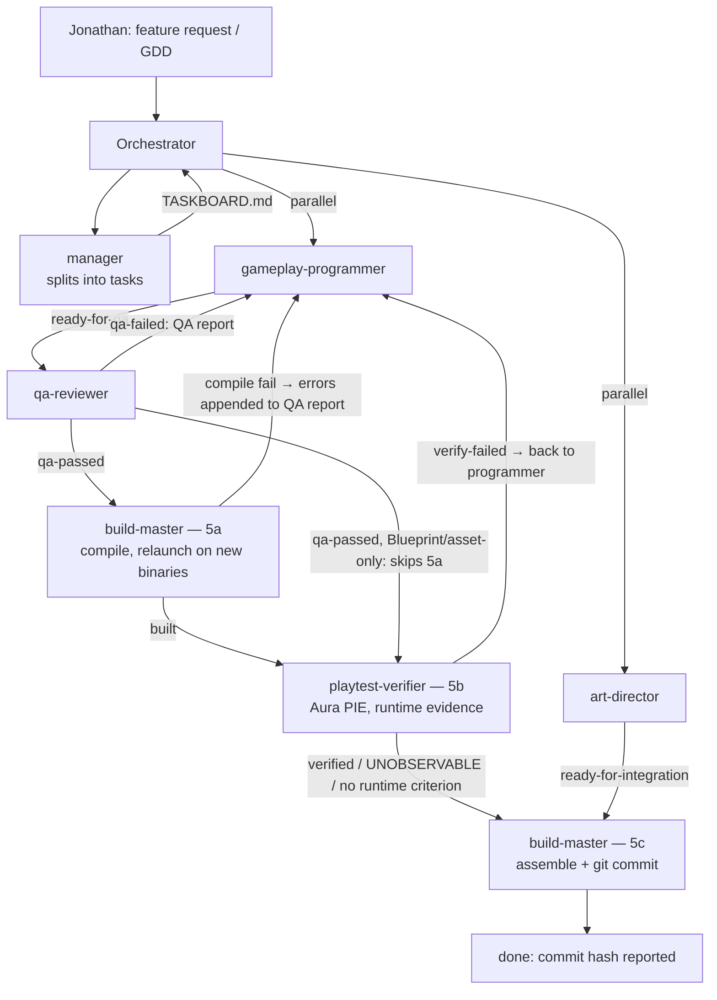

# TASK-1354 — [AGENT-VAULT-DIAGRAM-SYNC] — gameplay-programmer handoff

**Marker:** `TASK-1354-AGENT-VAULT-DIAGRAM-SYNC` · **Date:** 2026-09-20 · **Gate:** ⛔ WAIVED at boarding (this row's own `names:` line + ROUTING block — recorded here, not granted here).

---

## 0. ⛔ THE STATUS FLIP IS NOT MINE, AND IT IS OWED — SAY IT FIRST SO THE RELAY CANNOT BE DROPPED

`SC-§134` cl. 7(b). My `names:` block does **not** include `TASKBOARD.md`, and this row's `status:` line names its flipper explicitly:

> *"⛔ THE FLIPPER IS ⛔ NAMED: ⛔ the ⛔ MANAGER — ⛔ exactly as on ⭐ `TASK-1231`, ⛔ whose fence worked and ⛔ whose flip then sat ⛔ owed for a day."*

⇒ **I did not touch `TASKBOARD.md`.** The row still reads `backlog` on disk while its work is complete. **The manager owes this flip.** This is the exact gap that left `TASK-1231` sitting `backlog` for a day with its deliverable already shipped.

**Routing after this row, per its own spec — no 5a, no 5b:** nothing to compile, and no runtime acceptance criterion (⛔ this is **not** an `UNOBSERVABLE` — it was never owed). My handoff is the only in-repo artefact and rides `TASK-1355` or the next host, derived at that host's own instant (`SC-§133`).

---

## 1. WHICH FILES ARE IN THE REPO AND WHICH ARE IN THE VAULT — ⛔ ASKED FOR EXPLICITLY, ANSWERED EXPLICITLY

| File | Tree | Written by me? |
|---|---|---|
| `C:\GitProjects\GitHub\MyObsidianVault\JonWesOBVault\UE5 Agent Team System.md` | 🟢 **VAULT — outside the repo.** Separate git tree at `C:\GitProjects\GitHub\MyObsidianVault`. Appears in **no** `git status` of this project and there is **nothing to commit for it.** | ✅ **YES — this is the deliverable.** |
| `.claude/pipeline/handoffs/TASK-1354-programmer.md` (this file) | 🔴 **INSIDE THE REPO** (git root one level up — `SC-§102`) | ✅ **YES — my only in-repo write.** |

⇒ 🚨 **For `TASK-1355`'s pathspec: exactly ONE file of mine is inside the repo — this handoff.** It is a `handoffs/` note, arrived during your staging window. `TL-§5e` cl. 7a's mtime rule governs: **ARRIVED ⇒ LEAVE IT**, named by name and by kind. I wrote **nothing** else in the repo — no code, no asset, no `TASKBOARD.md`, no `CONVENTIONS.md`, no `Source/**`, no `Saved/**`, no `.uproject`. I ran no compile, no suite, no git command that writes, and touched no editor.

**Re-measured, not inherited (`SC-§91`): NO `Docs/` TWIN EXISTS for this note.**

```
$ ls Docs/
Aura AI for Unreal — Integration Plan.md   AuraIndexIgnore.txt   AuraProjectMemory.md   Data/
GDD-Submission-v3.pdf   GDD-TEMPLATE.md   GDD-UPDATE-2026-07-21.md   GDD.md   Packaging/
ThirdPartyNotices.md    setupdirections.md

$ find "C:/GitProjects/GitHub/GitClaudeUnrealTesting" -iname "*Agent Team System*"
                                        # ⇒ EMPTY. No twin anywhere in the repo tree.
```

`TASK-1231`'s sentence holds, and it holds **because I measured it again**, not because it was written down. Unlike the Aura plan note, this one is vault-only — there is no second copy to keep byte-identical.

---

## 2. THE FILE'S `sha256`, BEFORE AND AFTER

| | `sha256` | bytes |
|---|---|---|
| **BEFORE** | `d4ee02895b06c0d4f3ff18fa71a22374673ae64a39e1478f7e7cf067a67fb853` | 17,246 |
| **AFTER** | `5dbd489402e0c93239b9daad4d4be900d07620c0f166836ab39909bcc6ec8eac` | 20,521 |

The hash **changed** — the write landed. (+3,275 bytes.)

---

## 3. WHERE THE AUTHORITATIVE SEQUENCE CAME FROM — ⛔ DERIVED AT MY OWN INSTANT, NOT FROM THE DISPATCH'S SUMMARY

`SC-§91` and the spec's (2) are explicit that the dispatch's prose is **not** the law. Every token below was read off disk today:

**`CLAUDE.md` lines 46–51, § Routing rules, rule 5 (`## Routing rules` at line 39):**

```
5. `qa-passed` → the compile/verify/commit chain (law: CONVENTIONS VER-§):
   - **5a** `qa-passed` → `build-master` compiles (`Result: Succeeded` law) and, for C++ changes,
     relaunches the editor on the new binaries (graceful-quit lane, never Live Coding).
     Status → `built`. No commit yet.
   - **5b** if the task's spec has a runtime acceptance criterion → invoke `playtest-verifier`.
     `verify-failed` → send back to `gameplay-programmer` with the verify report path; it counts
     as a QA loop (same max-3-then-escalate as rule 4). Blueprint/asset-only tasks skip 5a and go
     straight here.
   - **5c** `verified` (or `UNOBSERVABLE`, or no runtime criterion) → invoke `build-master` to
     assemble and commit as today.
6. Build failure → build-master appends errors to the QA report and you route back to
   `gameplay-programmer` (this counts as a QA loop).
```

**`CLAUDE.md` lines 63–70, § Hard gates:**

```
- Nothing is committed to Git without a PASS QA report (code) or completed integration check (art).
- Nothing with a runtime acceptance criterion is committed without a VERIFIED report; UNOBSERVABLE
  is recorded on the row, not treated as a pass.
- Aura verification drives PIE; when Jonathan is present the dispatch announces it first and waits for a go.
- Never push to remote unless the user explicitly asks.
```

**`CONVENTIONS.md` `VER-§1` cl. 1** (line 12108) — *"nothing precedes it (the H1 `# Verification — TASK-###` is line 2), so `head -1` of any report IS its verdict."*
**`CONVENTIONS.md` `VER-§5` cl. 1** (line 12162) — `UNOBSERVABLE` = *"the row has nothing PIE can see"*; cl. 2 — it *"DOES NOT block"*, routing *"proceeds to 5c exactly as a row with no runtime criterion would"*.
**`CONVENTIONS.md` `VER-§6` cl. 5, dated amendment 2026-09-14** (line 12174) — *"a `VERIFY-FAILED` BLOCKS the commit host and bounces the row to `gameplay-programmer` with the `qa/TASK-###-verify.md` path, as a QA loop: max 3, then escalate to 🧑 him"*.

⇒ **The real lifecycle:** `backlog` → `in-progress` → `ready-for-qa` → `qa-passed`/`qa-failed` → **`built`** → **`verified`** → `integrating` → `done`, with **three** backward edges (`qa-failed` r.4 · `compile fail` r.6 · **`verify-failed` r.5b**), all to the `gameplay-programmer`, all capped at 3 loops.

---

## 4. THE AGENT COUNT — RE-MEASURED ON DISK, NOT INHERITED

```
$ ls -1 .claude/agents/*.md | wc -l
7

art-director.md   build-master.md   footage-analyst.md   gameplay-programmer.md
manager.md        playtest-verifier.md                   qa-reviewer.md
```

**7.** The note's Status callout already reads **7** and its roster table already carries **7 rows** — `TASK-1231`'s work, ruled KEPT by the manager (including the `footage-analyst` row). ⛔ **I did not touch either.** The measurement confirms them correct as shipped; I re-ran it rather than trusting the dispatch's sentence, and it agrees.

---

## 5. THE DIFF, QUOTED — BEFORE AND AFTER FOR EVERY LINE I CHANGED

### (a) THE LIFECYCLE LINE

**BEFORE** (one line):
```markdown
**Task lifecycle:** `backlog` → `in-progress` → `ready-for-qa` → `qa-passed`/`qa-failed` → `integrating` → `done` (art tasks skip QA and go `ready-for-integration`).
```

**AFTER:**
```markdown
**Task lifecycle:** `backlog` → `in-progress` → `ready-for-qa` → `qa-passed`/`qa-failed` → `built` → `verified` → `integrating` → `done` (art tasks skip QA and go `ready-for-integration`).

The three stages after `qa-passed` are the **compile/verify/commit chain**, quoted verbatim from `CLAUDE.md` § Routing rules (rule 5, *"law: CONVENTIONS VER-§"*):

- **`qa-passed` → `built` (5a)** — *"`qa-passed` → `build-master` compiles (`Result: Succeeded` law) and, for C++ changes, relaunches the editor on the new binaries (graceful-quit lane, never Live Coding). Status → `built`. No commit yet."*
- **`built` → `verified` (5b)** — *"if the task's spec has a runtime acceptance criterion → invoke `playtest-verifier`. `verify-failed` → send back to `gameplay-programmer` with the verify report path; it counts as a QA loop (same max-3-then-escalate as rule 4). Blueprint/asset-only tasks skip 5a and go straight here."*
- **`verified` → `integrating` → `done` (5c)** — *"`verified` (or `UNOBSERVABLE`, or no runtime criterion) → invoke `build-master` to assemble and commit as today."*

> [!important] There are **two** loop-backs to the programmer, not one
> `qa-failed` → `gameplay-programmer` (rule 4: *"Loop until `qa-passed` (max 3 loops, then escalate to the user)"*) **and** `verify-failed` → `gameplay-programmer` (rule 5b, *"counts as a QA loop"*). A third path exists for build failure — rule 6: *"build-master appends errors to the QA report and you route back to `gameplay-programmer` (this counts as a QA loop)"*.
> The `verified` gate became **binding** on 2026-09-14, when Jonathan ruled *"binding"* on `TASK-1230` — `CONVENTIONS.md` `VER-§6` cl. 5, dated amendment: *"a `VERIFY-FAILED` BLOCKS the commit host and bounces the row to `gameplay-programmer` with the `qa/TASK-###-verify.md` path, as a QA loop: max 3, then escalate to 🧑 him"*. Before that date the whole lane was advisory; a reader of an older copy of this note would not know the gate has teeth.
```

**Token trace:** `built` ← 5a's *"Status → `built`"* · `verified` ← 5c's *"`verified` (or `UNOBSERVABLE`, …)"* · `integrating` **kept from the original** and independently live on the board (`TASK-1355`'s `parallel-safe:` line reads *"your `integrating` status trips its pre-flight"*) · the `ready-for-integration` parenthetical **kept verbatim**.

### (b) THE HARD-GATES LINE

**BEFORE** (one line):
```markdown
**Hard gates:** nothing commits to Git without a PASS QA report; QA-fix loop escalates to Jonathan after 3 failures; no pushes to remote unless explicitly requested.
```

**AFTER:**
```markdown
**Hard gates**, verbatim from `CLAUDE.md` § Hard gates:

- *"Nothing is committed to Git without a PASS QA report (code) or completed integration check (art)."*
- *"Nothing with a runtime acceptance criterion is committed without a VERIFIED report; UNOBSERVABLE is recorded on the row, not treated as a pass."* ← **the second gate, and the one the older version of this note was missing.** `UNOBSERVABLE` = *the row has nothing PIE can see* (`CONVENTIONS.md` `VER-§5` cl. 1); it never blocks the commit and it is never read as a pass.
- *"Aura verification drives PIE; when Jonathan is present the dispatch announces it first and waits for a go."*
- *"Never push to remote unless the user explicitly asks."*

Plus, unchanged: the QA-fix loop escalates to Jonathan after 3 failures.
```

Each bullet is a **character-for-character** quote of a `CLAUDE.md` bullet, not a re-wording of the dispatch. Note that the old line's *"nothing commits to Git without a PASS QA report"* was a **paraphrase** that silently dropped `(code) or completed integration check (art)` — the art half of the gate had been invisible in this note. It is now present.

### (c) THE MERMAID FLOWCHART

**BEFORE** (the six changed lines; the first six lines of the block are untouched):
```
    P -->|ready-for-qa| Q[qa-reviewer]
    Q -->|qa-failed: QA report| P
    Q -->|qa-passed| B[build-master]
    A -->|ready-for-integration| B
    B -->|compile fail → back to programmer| P
    B -->|compile + assemble + git commit| D[done: commit hash reported]
```

**AFTER — THE WHOLE BLOCK, PASTED SO A READER CAN CHECK THE EDGES WITHOUT OPENING THE VAULT:**

````markdown

````

Followed in the note by:

```markdown
Read the **backward** edges first — `qa-failed`, `compile fail` and **`verify-failed`** all land back on the `gameplay-programmer`, and each one burns a loop; after three, the orchestrator escalates to Jonathan. The happy path is the boring one. The `verify-failed` bounce carries a path: `.claude/pipeline/qa/TASK-###-verify.md`, whose line 1 is the verdict, byte-literal (`CONVENTIONS.md` `VER-§1` cl. 1 — *"nothing precedes it … so `head -1` of any report IS its verdict"*).
```

**What is new in the diagram, edge by edge:**

| Edge | Source |
|---|---|
| **`V` node — `playtest-verifier`** | the node the spec names; 7th agent, `.claude/agents/playtest-verifier.md` |
| `B -->|built| V` | 5a's *"Status → `built`"* handing to 5b |
| `Q -->|"qa-passed, Blueprint/asset-only: skips 5a"| V` | 5b's *"Blueprint/asset-only tasks skip 5a and go straight here"* — **the diagram previously had no way to express this at all** |
| ⭐ **`V -->|"verify-failed → back to programmer"| P`** | 5b's *"`verify-failed` → send back to `gameplay-programmer`"* — **the loop-back edge named on my row.** A reader of the old diagram could not have learned this path exists. |
| `V -->|verified / UNOBSERVABLE / no runtime criterion| C` | 5c verbatim — all three admitting conditions on one edge, so `UNOBSERVABLE` is visibly **not** a blocker |
| `B` split into `5a` and `C` = `5c` | the old single `build-master` node collapsed compile and commit into one box, which is precisely what made the `verified` gate undrawable — there was no *between* for it to sit in |
| `B -->|compile fail → errors appended to QA report|` (reworded from *"back to programmer"*) | rule **6** verbatim: *"build-master appends errors to the QA report and you route back to `gameplay-programmer`"* — the old label omitted the QA-report append |

🚨 **TWO SYNTAX RISKS I FOUND AND REMOVED BEFORE SHIPPING — declared because a diagram that does not render is a worse defect than one that is incomplete, and I cannot render mermaid from here:**
1. My first draft put `qa/TASK-###-verify.md` **inside an edge label**. Mermaid treats `#` as the start of an entity code (`#nnn;`). `###-verify.md` has no terminating `;` so it *should* render literally — but *should* is not *measured*, and I cannot measure a render. ⇒ I moved the path into the **prose line below the diagram**, where it is markdown and cannot break the parser. The information is one line away, at zero risk.
2. The two edge labels containing a comma + colon + slash are **quoted** (`-->|"…"|`), mermaid's documented escape for special characters. The unquoted labels I left unquoted all match shapes the original block already proved render in this vault (`→` in `compile fail → …`, `:` in `qa-failed: QA report`).

🧑 **ONE THING FOR JONATHAN'S EYE, AND IT IS THE ONLY THING I COULD NOT MEASURE:** open the note in Obsidian and confirm the flowchart **renders**. Every claim above about the diagram's *content* is checkable from this handoff; its *rendering* is not.

---

## 6. ⛔ THE `MEASURED` DECISION — MY SPEC DOES NOT COVER IT, SO I LEFT IT, AND HERE IS THE REASON

`CONVENTIONS.md` was amended today with a **fourth** verdict token, `MEASURED` (`VER-§1` cl. 3a, marker `VER-1-3A-THE-CONTROLLED-NEGATIVE-CELL`; cl. 5a, marker `VER-1-5A-THE-MEASURED-BRANCH`). I read both live. **I did not draw it, and the decision is deliberate, not an oversight:**

1. **It is not a lifecycle status.** (a)'s subject is the status chain — `backlog … done`. `MEASURED` is a *verdict token on line 1 of a report*, like `VERIFIED`/`UNOBSERVABLE`. It has no cell in a status chain.
2. **It is not in the hard-gates text I was told to quote.** (b) says *"Quote it from the file, ⛔ do not re-word it from here."* `CLAUDE.md`'s § Hard gates names `VERIFIED` and `UNOBSERVABLE` **and does not contain the string `MEASURED`** (measured: `grep -c MEASURED CLAUDE.md` ⇒ the token is absent). Writing it into a bullet presented as *"verbatim from `CLAUDE.md`"* would have made that attribution **false** — the exact failure mode this row exists to repair.
3. **It is not among the edges (c) names**, and its routing makes it un-drawable as a distinct edge anyway: `VER-§1` cl. 5a — *"IT ⛔ NEVER BLOCKS AND ⛔ NEVER BOUNCES … 5c proceeds (the `VER-§5` cl. 2 treatment, shared with `UNOBSERVABLE`)"*. ⇒ **A `MEASURED` row traverses the diagram along the edge I already drew** (`verified / UNOBSERVABLE / no runtime criterion → 5c`). Giving it a loop-back arrow would be actively wrong; giving it a node would add a box with no distinct path.

⇒ **Ruling: out of scope, left untaken, declared loudly (`SC-§100`).** The narrowest true statement is that the 5c edge label should eventually read `verified / UNOBSERVABLE / MEASURED / no runtime criterion` — **a four-word edit**, but only *after* the upstream text it would be quoting says so. Which brings me to F1.

---

## 7. ⛔ FINDINGS — NAMED, NOT TAKEN (spec (4): *"NAME IT, DO NOT TAKE IT"*). ⭐ `SC-§50`: A DECLARED GAP WITH NO ROW SHIPS.

**⭐ F1 — THE BIGGEST ONE, AND IT IS NOT IN MY SUBJECT FILE AT ALL: `CLAUDE.md` DOES NOT KNOW `MEASURED` EXISTS — AND IT IS ⛔ TWO SITES, NOT ONE.**

```
$ grep -c "MEASURED" CLAUDE.md
0                                        # ⇒ the token is ABSENT from the file, measured not assumed

$ grep -n "VERIFIED\|UNOBSERVABLE" CLAUDE.md
25:- `.claude/pipeline/qa/TASK-###-verify.md` — runtime verification reports from `playtest-verifier`
     (`VERIFIED` / `VERIFY-FAILED` / `UNOBSERVABLE`; law: CONVENTIONS VER-§)
49:   - **5c** `verified` (or `UNOBSERVABLE`, or no runtime criterion) → …
66:- Nothing with a runtime acceptance criterion is committed without a VERIFIED report; UNOBSERVABLE
     is recorded on the row, not treated as a pass.
```

- **Site 1 — line 25**, § *How agents communicate*: an **explicit three-token enumeration**, `VERIFIED` / `VERIFY-FAILED` / `UNOBSERVABLE`, of a vocabulary that `CONVENTIONS.md` `VER-§1` cl. 1 now defines as **four**. ⇒ 🚨 **This is the worse of the two: a reader who greps `CLAUDE.md` for the legal verdict tokens gets a list that is *complete-looking and incomplete* (`SC-§105`) — it reads as exhaustive, and it is wrong by one.**
- **Site 2 — line 66**, § Hard gates: enumerates `VERIFIED` and `UNOBSERVABLE` and their routing, silent on `MEASURED`.

`VER-§1` cl. 5a mints the token with explicit routing (*"5c proceeds … does NOT burn a QA loop … does NOT return the row to the `gameplay-programmer`"*) and cl. 3a makes its cell rule non-optional. ⇒ **This is `TASK-1354`'s own defect one level up: the orchestrator's rules document a gate whose vocabulary its own law file has outgrown — on the very day the law changed.** `CLAUDE.md` is **READ-only** on my `names:` line. ⛔ **Not taken. Needs a row, and it is upstream of everything else here** — the vault note inherits the fix automatically, since its gates bullets are quotes of that file, and my §6 `MEASURED` ruling becomes a four-word edit the moment site 2 is fixed.

**F2 — `(the five agents)` at line 302 of the vault note. STALE, MEASURED WRONG, NOT TAKEN.**
> *"Starting in the project root is what loads the whole system: `CLAUDE.md` (orchestrator rules), `.claude/agents/` (**the five agents**), `.mcp.json` (Unreal + Blender)."*

The directory holds **7** (§4). This is the **same 5→7 defect `TASK-1231` fixed in the roster table and the Status callout**, surviving in a third place neither row's spec named. ⛔ I left it — it is neither the lifecycle line, the gates line, nor the mermaid, and spec (3) fences me off `TASK-1231`'s roster work. **One-word edit; needs a row.**

**F3 — the Communication Architecture bullet list is short by three files.** Lines 103–106 list `TASKBOARD.md`, `CONVENTIONS.md`, `handoffs/`, `qa/`. `CLAUDE.md` § *How agents communicate* also lists `.claude/pipeline/qa/TASK-###-verify.md` (*"runtime verification reports from `playtest-verifier`"*), `.claude/pipeline/footage/` (VID-### reports) and `.claude/pipeline/SLACK.md`. ⚠️ **This one now has a visible seam I created:** my prose under the diagram cites `.claude/pipeline/qa/TASK-###-verify.md`, and the bullet list four lines above it does not mention that file. The seam is small and the citation is correct; fixing the list is three bullets. ⛔ **Not taken — declared because I am the one who made it visible.**

**F4 — two prose restatements of the old single-gate model, both now narrower than the gates line directly below them.** Line 74 (§ Workflow step 5): *"A **review/QA step** verifies results before anything is committed to Git"*. Line 80 (§ Design principles): *"**Verify before commit.** No agent pushes to Git without a QA pass."* Neither is **false** — both are just pre-`verified` framing, the identical shape of the defect I was sent to repair. ⛔ Not taken; low priority, cosmetic next to F1/F2.

**F5 — no stale vault path anywhere.** Re-measured: the note contains **zero** occurrences of the old root `C:\JonWesOBVault`. `TASK-1231`'s F5 holds.

**F6 — `TASK-1231`'s roster and tool-layer tables: inspected, believed CORRECT, untouched.** Roster = 7 rows matching the 7 files on disk, one-for-one. Tool-layer table's `playtest-verifier` grant counts (49 + 32) I did **not** re-audit — out of scope and not mine to correct if wrong. Nothing to flag.

---

## 8. WHAT QA / A REVIEWER SHOULD SCRUTINISE

The gate is **waived** on this row, which raises rather than lowers the bar — so the four things most worth an adversarial read:

1. **Is every quoted bullet actually byte-identical to `CLAUDE.md`?** Diff §3's quoted blocks against lines 46–51 and 63–70. A quote that drifted is the exact defect class this row repairs.
2. **The mermaid renders?** 🧑 pixel check only — see §5. I could not measure it.
3. **Two declared scope stretches, taken small, revertible alone** (`SC-§100`):
   - **(i)** I added **two** `CLAUDE.md` gate bullets the old line did not carry — the `VERIFIED` one the spec demands, **plus** *"Aura verification drives PIE; when Jonathan is present the dispatch announces it first and waits for a go."* Reason: it is in the same § Hard gates section I was told to quote, and it is the gate that governs whether **Jonathan gets interrupted** — the one a reader of a note titled *"UE5 Agent Team System"* most needs. **The line was drawn, not forgotten:** I deliberately did **not** add the remaining two `CLAUDE.md` gates (editor+MCP must be running; gameplay videos never committed) because neither concerns the verify gate. Revert that one bullet if the manager disagrees; nothing depends on it.
   - **(ii)** I reworded the existing `compile fail` edge label to name the QA-report append (rule 6). It is an edge I was already rewriting to re-target the split `build-master` node, and the old label was incomplete in the same way as everything else on this row.
4. **`integrating` is retained on the lifecycle line but is not in `CLAUDE.md`.** I did not invent it and did not remove it: it was already there, and it is independently live on the board (`TASK-1355`'s `parallel-safe:` line). If a reviewer wants it sourced to law rather than to usage, that is a finding about the **board**, not about my edit.

---

## 9. ⏳ OWED, SO IT CANNOT BE DROPPED SILENTLY

- 🚨 **The manager flips `TASK-1354`'s `status:` line.** Not me — `SC-§134` cl. 7(b), and this row's own `status:` names the manager as flipper. On disk it still reads `backlog`.
- 📋 **F1 + F2 + F3 need rows** (F1 first — it is upstream of this note and of every future copy of these bullets).
- 🧑 **One pixel check from Jonathan:** does the flowchart render in Obsidian.
- 🚨📦 **THIS HANDOFF IS NOW A MEASURED ORPHAN WITH NO NAMED TAKER (`SC-§50` · `TL-§5e` cl. 7a).** `TASK-1355` was the expected rider. **It has already committed** — and correctly **without** this file, because this file did not exist at its staging instant:

  ```
  $ git log --oneline -1
  36d85d3 TASK-1355 (docs-only host for the agent-drivability wave): …

  $ git log --oneline -1 --name-only        # 8 paths; handoffs/TASK-1354-programmer.md is NOT among them
  CONVENTIONS.md · TASKBOARD.md · handoffs/TASK-1350-manager.md · handoffs/TASK-1351-buildmaster.md
  playtest-evidence/2026-09-20/VER-TASK-1348-a2-… .png · …-a3-… .png
  qa/TASK-1348-verify.md · qa/TASK-1349-report.md

  $ git status --porcelain
   M GitClaudeUnrealTest/.claude/pipeline/TASKBOARD.md                        # ⛔ NOT MINE — the manager
  ?? GitClaudeUnrealTest/.claude/pipeline/handoffs/TASK-1354-programmer.md    # ⛔ MINE, UNCOMMITTED, UNOWNED
  ```

  `TASK-1355`'s row pre-named me as *"`handoffs/TASK-1354-programmer.md` ⛔ IF PRESENT (⛔ else ⛔ name it as ⛔ not-yet-arrived)"* — the **not-yet-arrived** branch fired. ⇒ **No host's pathspec currently names this file.** It needs the **next** host, derived at that host's own instant (`SC-§133`). This is exactly the orphan shape `TASK-1351` was boarded to clean up for `TASK-1231`; flagging it now so it does not sit for a day.
- 📦 **Scope reminder for whichever host takes it:** one repo file of mine, `handoffs/TASK-1354-programmer.md`, and nothing else. The vault note is **not** committable from this repo and appears in no `git status` here.
